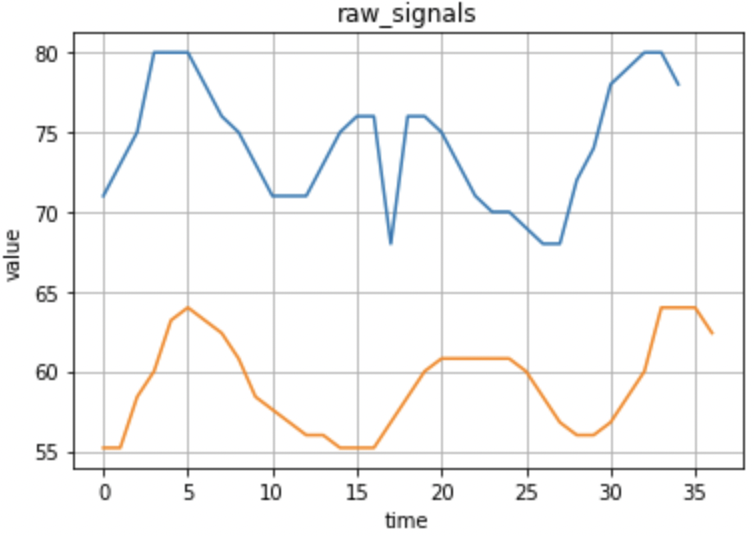
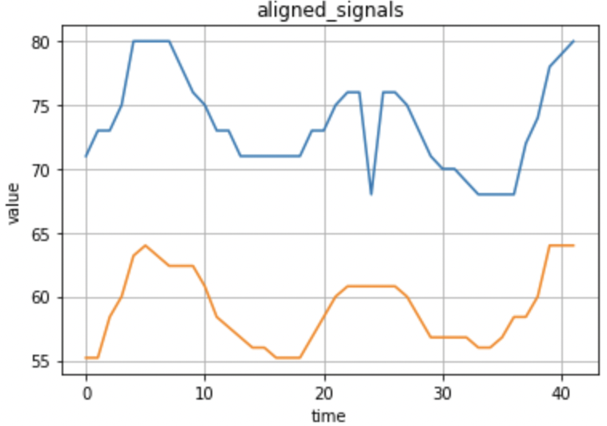

# *fastddtw*: Fast Derivative Dynamic Time Warping

*fastddtw* is an efficient implementation of Derivative Dynamic Time Warping proposed by [*Keogh et al*](https://www.ics.uci.edu/~pazzani/Publications/sdm01.pdf). The fast calculation comes from a Sakoe-Chuba Band constraint discussed in [*FastDTW*](https://cs.fit.edu/~pkc/papers/tdm04.pdf).       
Drexel University EESI Lab, 2020        
Maintainer: Zhengqiao Zhao, zz374 at drexel dot edu        
Owner: Gail Rosen, gailr at ece dot drexel dot edu  

## Dependencies
The following are required:    
- python>=3.5.4
- matplotlib>=2.1.1

## Derivative Dynamic Time Warping (DDTW)
> Time series are a ubiquitous form of data occurring in virtually every scientific discipline. A common task with time series data is comparing one sequence with another. In some domains a very simple distance measure, such as Euclidean distance will suffice. However, it is often the case that two sequences have the approximately the same overall component shapes, but these shapes do not line up in time domain. 
> In order to find the similarity between such sequences, or as a preprocessing step before averaging them, we must "warp" the time axis of one (or both) sequences to achieve a better alignment. Dynamic time warping (DTW) , is a technique for efficiently achieving this warping. 
> However, DTW can produce produce pathological results. For example, the algorithm may fail to find obvious, natural alignments in two sequences simply because a feature (i.e peak, valley, inflection point, plateau etc.) in one sequence is slightly higher or lower than its corresponding feature in the other sequence. The problem can be addressed introducing a modification of DTW, Derivative Dynamic Time Warping. The crucial difference is in the features we consider when attempting to find the correct warping. Rather than use the raw data, we consider only the (estimated) local derivatives of the data.
>

The following formula discribes the derivative computation of a time series signal, q:


> where i is a position of interest.
> This modification of dynamic time warping can produce superior alignments between time series compared with DTW in the experiments. 
> 
> --- Adapted from [Keogh, Eamonn J. and M. Pazzani. “Derivative Dynamic Time Warping.” SDM (2001).](https://www.ics.uci.edu/~pazzani/Publications/sdm01.pdf)

## Fast implementation of DDTW
> The time complexity is of the DDTW is the same as the DTW which is $O(n^2)$. We desire to develop a dynamic time warping
algorithm that is linear in both time and space complexity and can find a warp path between two time series that is nearly optimal. A dynamic programming approach is used to find this minimum-distance warp path. Instead of attempting to solve the entire problem all at once, solutions to sub-problems (portions of the time series) are found, and used to repeatedly find solutions to a slightly larger problem until the solution is found for the entire time series. A two-dimensional cost matrix, D, is constructed To find the minimum-distance warp path, every cell of the cost matrix must be filled. 
> One of the DTW speedup method is to limit the number of cells that are evaluated in the cost matrix. For example, Sakoe-Chuba Band defiens a width along the diagnoal to search for the optimal path. The width is specified by a parameter. When the constraint is used, the DTW algorithm finds the optimal warp path through the constraint window. 
>
> Adapted from [Salvador, S. and P. Chan. “FastDTW: Toward Accurate Dynamic Time Warping in Linear Time and Space.” (2004).](https://cs.fit.edu/~pkc/papers/tdm04.pdf)

By combining the idea of fastDTW and DDTW, we develop a fast implementation of DDTW that is of $O(n)$ time complexity.

## Tutorial
To perform the Fast Derivative Dynamic Time Warping for two time series signal, you can run the following command:
```python
distance, path = fast_ddtw(signal_1, signal_2, K = 10)
```
where `signal_1` and `signal_2` are numpy arrays of shape (n1,  ) and (n2,  ). `K` is the Sakoe-Chuba Band width used to constrain the search space of dynamic programming. This function returns the `distance` which is the Derivative Dynamic Time Warping distance and the `path` for optimal path. For example, the following figure shows the two time-series signals:        

        

If you directly compute the euclidean distance between these two signals, the time shift is not considered. However, when running our `fast_ddtw` function, the time shift as well as the value difference after the alignment will be taken into consideration.
To help visualize the process, we also developed a series of functions:
1. To plot the search space:
```python
plot_actual_search_space(signal_1, signal_2, K = 10)
```
2. To plot the optimal path in the search space (`fast_ddtw` must run first):
```python
plot_path_in_search_space(signal_1, signal_2, path, K = 10)
```
To improve the computational efficiency and prevent the algorithm to consider too big of a time delay, a search space constraint can be placed. The following figure shows an example of the Sakoe-Chuba Band used to reduce the search space.        


3. To plot the two signals after time warping (`fast_ddtw` must run first):
```python
plot_aligned_signals(signal_1, signal_2, path, title = 'aligned_signals')
```
After alignment, the lags between time-series are compensated and the resultant distance between two time-series considers both the lag and the difference given the two signals are aligned. The following figure shows the signals after the alignment:        

        

For more information, please refer to the [jupyter notebook demo](_FAST_DDTW_demo.ipynb) 


 
